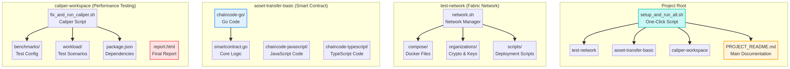

# 🎓 نظام إدارة وتوثيق الشهادات الأكاديمية باستخدام البلوك تشين (BCMS)

**A Hyperledger Fabric & Go Implementation with Caliper Benchmarking**

---

## 📖 1. تعريف وشرح المشروع (Project Description)

هذا المشروع عبارة عن نظام لامركزي آمن يهدف إلى **إصدار، إدارة، وحماية الشهادات الجامعية** من التزوير باستخدام تقنية **Hyperledger Fabric**. يعتمد النظام على **عقد ذكي (Smart Contract)** مكتوب بلغة **Go** لضمان سرعة الأداء وكفاءة التحقق. كما يتضمن المشروع اختبارات أداء شاملة باستخدام أداة **Hyperledger Caliper** لقياس قدرة الشبكة على معالجة المعاملات (TPS) وزمن الاستجابة (Latency).

> This project creates a tamper-proof ecosystem for academic certificates using Blockchain technology. It allows universities to issue digital certificates that can be instantly verified globally, ensuring trust and integrity.

---

## 🏗️ 2. مكونات النظام وهيكليته (System Architecture)

يتكون المشروع من العناصر التقنية التالية:

| المكون (Component) | التفاصيل (Details) |
| :--- | :--- |
| **Blockchain Network** | **Hyperledger Fabric v2.5** (Latest Stable Version). |
| **Consensus Algorithm** | **Raft** (EtcdRaft) - لضمان توافق الشبكة وترتيب المعاملات. |
| **Organizations** | **2 Organizations (Org1, Org2)** + **1 Orderer Service**. |
| **Smart Contract** | مكتوب بلغة **Golang (Go)** لضمان أداء عالٍ (High Performance). |
| **Benchmarking Tool** | **Hyperledger Caliper** (لقياس السرعة والضغط). |
| **Database** | **CouchDB / LevelDB** (لتخزين الحالة الحالية للشهادات). |

### 🗺️ المخطط الهيكلي للمشروع (Project Structure Map)



---

## 📁 3. شرح الملفات والمجلدات الرئيسية

هذا الجدول يوضح وظيفة كل ملف ومجلد رئيسي في المشروع:

| المسار (Path) | الوصف (Description) |
| :--- | :--- |
| **`setup_and_run_all.sh`** | 🚀 **السكربت الشامل**: يقوم بأتمتة العملية بأكملها: تحميل أدوات Fabric، تشغيل الشبكة، نشر العقد الذكي (Go)، وتشغيل اختبار Caliper. |
| `test-network/` | 🌐 **مجلد الشبكة**: يحتوي على إعدادات شبكة Hyperledger Fabric الأساسية المأخوذة من `fabric-samples`. |
| `test-network/network.sh` | ⚙️ **مدير الشبكة**: سكربت لإدارة شبكة Fabric (up, down, createChannel, deployCC). |
| `asset-transfer-basic/` | 📜 **مجلد العقود الذكية**: يحتوي على العقد الذكي (chaincode) بلغات متعددة. |
| `asset-transfer-basic/chaincode-go/` | ✅ **العقد الذكي Go**: نسخة Go من العقد الذكي، وهي المستخدمة حالياً في المشروع. |
| `caliper-workspace/` | ⚡ **مجلد اختبار الأداء**: البيئة المخصصة لاختبارات الأداء باستخدام Hyperledger Caliper. |
| `caliper-workspace/fix_and_run_caliper.sh` | 🔧 **سكربت إصلاح Caliper**: سكربت متخصص لإصلاح مشاكل Caliper الشائعة وتشغيل الاختبارات. |
| `caliper-workspace/benchmarks/` | 📊 **إعدادات الاختبار**: يحتوي على ملف `benchConfig.yaml` الذي يحدد جولات الاختبار (مثل issue, verify, revoke). |
| `caliper-workspace/workload/` |  сценарии **سيناريوهات الاختبار**: يحتوي على ملفات JavaScript التي تحدد منطق كل معاملة اختبار. |
| `caliper-workspace/report.html` | 📈 **التقرير النهائي**: تقرير الأداء النهائي بصيغة HTML الذي يتم إنشاؤه بواسطة Caliper. |
| `PROJECT_README.md` | 📖 **التوثيق الرئيسي**: ملف توثيق شامل للمشروع. |

---

## 🚀 4. دليل التشغيل السريع (How to Run)

تم تصميم هذا المشروع ليعمل بـ **أمر واحد فقط** (One-Click Setup) بفضل سكربت الأتمتة المرفق.

### 🅰️ الخيار الأول: التشغيل عبر GitHub Codespaces (سحابياً)

وهي الطريقة الأسهل والأسرع (لا تتطلب تثبيت برامج على جهازك).

1.  قم بفتح المستودع (Repository) في **GitHub Codespaces**.
2.  افتح نافذة التيرمينال (Terminal).
3.  اكتب الأمر التالي واضغط Enter:

```bash
chmod +x setup_and_run_all.sh
./setup_and_run_all.sh
```

**ماذا سيحدث؟**
- سيقوم السكربت بتحميل أدوات Fabric تلقائياً.
- سيقوم بتشغيل الشبكة ونشر العقد الذكي.
- سيقوم بتثبيت وتشغيل اختبارات Caliper.
- **النتيجة**: بعد 5-8 دقائق، سيظهر لك تقرير النجاح.

### 🅱️ الخيار الثاني: التشغيل على سطح المكتب (Locally)

إذا أردت تشغيله على جهازك الشخصي (Linux / macOS / WSL2 on Windows)، يجب توفر المتطلبات التالية:

1.  **المتطلبات المسبقة (Prerequisites):**
    - **Docker Desktop**: (يجب أن يكون يعمل).
    - **Go Language**: (v1.19 أو أحدث).
    - **Node.js**: (v16 أو v18).
    - **cURL & Git**.

2.  **خطوات التشغيل:**
    أ) انسخ المشروع إلى جهازك:
    ```bash
    git clone https://github.com/MoainAlabbasi/fabric_certificate_MT.git
    cd fabric_certificate_MT
    ```
    ب) امنح صلاحيات التنفيذ للسكربت:
    ```bash
    chmod +x setup_and_run_all.sh
    chmod -R +x test-network/
    ```
    ج) شغّل السكربت الشامل:
    ```bash
    ./setup_and_run_all.sh
    ```

---

## 📊 5. تقرير الأداء (Benchmarks)

بعد انتهاء التشغيل، يقوم النظام بتوليد تقرير احترافي يوضح كفاءة الشبكة في المسار التالي: `caliper-workspace/report.html`

يتضمن التقرير اختبار 4 مراحل:

- ✅ **Issue Certificates**: قياس سرعة إصدار الشهادات.
- ✅ **Verify Certificate**: قياس سرعة التحقق (القراءة).
- ✅ **Query All**: قياس سرعة جلب البيانات الضخمة.
- ✅ **Revoke Certificate**: قياس سرعة الحذف من السجل.

---

## 👨‍💻 إعداد وتطوير (Credits)

تم تصميم وتطوير هذا المشروع بواسطة:

**المهندس / معين العباسي (Eng. Moain Al-Abbasi)**

- **GitHub:** [MoainAlabbasi](https://github.com/MoainAlabbasi)
- **Project:** Graduation Project - Blockchain Security Systems.

---

## 📄 الترخيص (License)

This project is licensed under the **Apache-2.0 License**.
